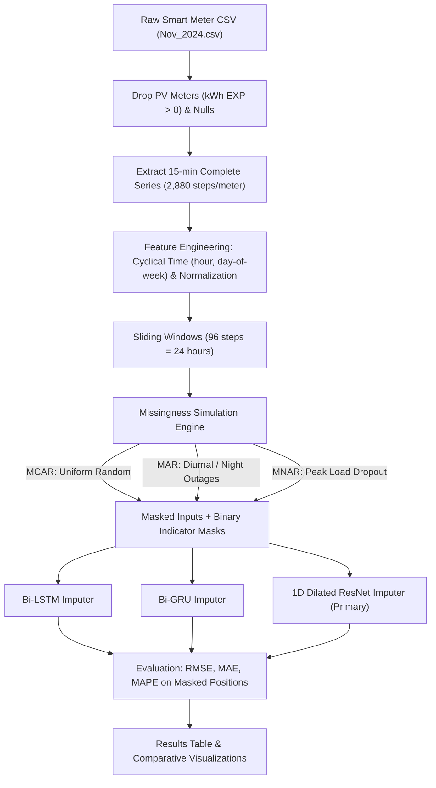

# Smart Meter Missing Value Imputation

Deep learning pipeline for imputing missing values in high-resolution (15-minute interval) smart meter electricity consumption data. Three architectures — **Bi-LSTM**, **Bi-GRU**, and a **1D Dilated ResNet** — are trained and benchmarked across multiple missingness mechanisms and rates.

**Dataset:** Indore smart meter data, November 2024 (`Nov_2024.csv`)

---

## Overview

Smart meter time series frequently suffer from gaps caused by communication failures, sensor faults, or outages. This project builds an end-to-end pipeline to simulate realistic missingness patterns and evaluate how well different neural architectures can reconstruct the missing readings.

Each model is trained and evaluated across:
- **3 missingness mechanisms:** MCAR, MAR, MNAR
- **4 missingness rates:** 10%, 20%, 30%, 40%

giving **36 experimental configurations** in total.

### Missingness mechanisms

| Mechanism | Description |
|---|---|
| **MCAR** (Missing Completely At Random) | Uniform, independent random masking |
| **MAR** (Missing At Random) | Elevated dropout probability during night hours (simulating overnight communication outages) |
| **MNAR** (Missing Not At Random) | Higher-consumption readings are more likely to be missing (simulating peak-load sensor/communication stress) |

---

## Pipeline



### Data preprocessing
1. **PV meter removal** — solar prosumer meters are identified via positive export energy (`kWh EXP > 0`) and known solar meter IDs, then dropped along with rows with missing/non-numeric readings, to establish a clean ground-truth series.
2. **Complete-series selection** — meters with a near-complete 15-minute grid (≥97% of the expected 2,880 readings for the 30 days of November 2024) are selected and reindexed to a full grid.
3. **Meter-level split** — data is split strictly **by meter** (70% train / 15% val / 15% test) to prevent data leakage between households.
4. **Caching** — a Parquet cache (`clean_<N>m.parquet`) is written after the first run so the raw CSV doesn't need to be rescanned on subsequent runs.
5. **Feature engineering** — per-meter min-max normalization plus cyclical time-of-day and day-of-week features (`sin`/`cos` encodings).
6. **Windowing** — the series is split into non-overlapping 24-hour (96-step) windows.

---

## Models

All models take a 5-channel input per timestep: `[masked_value, missingness_mask, hour_sin, hour_cos, dow_sin]`, and are trained with a **masked MSE loss** that weights reconstruction error on missing timesteps more heavily (0.8) than on observed timesteps (0.2).

| Model | Description |
|---|---|
| **Bi-LSTM** | Bidirectional LSTM capturing forward/backward temporal context over the full 24-hour cycle |
| **Bi-GRU** | Bidirectional GRU — fewer parameters than the LSTM, faster to converge |
| **1D Dilated ResNet** *(primary)* | Stem Conv1D (kernel 7) → 4 residual blocks with dilation rates `[1, 2, 4, 1]` → 1×1 Conv1D projection. Residual connections avoid vanishing gradients; dilation expands the receptive field across both short-term fluctuations and full daily cycles without adding parameters; fully parallelizable unlike the recurrent models. |

**Evaluation metrics:** RMSE, MAE, MAPE — computed strictly on the masked (missing) positions.

---

## Repository structure

```
smart_meter_imputation/
├── config.py                 # Central configurations, hyperparams, paths
├── data_loader.py             # CSV loading, PV filtering, parquet caching, windowing
├── missingness.py              # Simulation engines for MCAR, MAR, MNAR
├── models/
│   ├── __init__.py
│   ├── lstm_imputer.py         # Bidirectional LSTM Imputation Network
│   ├── gru_imputer.py          # Bidirectional GRU Imputation Network
│   └── resnet_imputer.py       # 1D Dilated ResNet Imputation Network
├── train.py                    # Training loop with masked MSE & early stopping
├── evaluate.py                 # Benchmark runner (RMSE, MAE, MAPE) & window plotters
├── run_all.py                  # Master execution script (36 benchmark configurations)
├── utils.py                    # Seed management, device setup, metric calculations
├── literature_review.md        # Comprehensive literature review
├── README.md
└── outputs/
    ├── models/                 # Saved PyTorch model checkpoints
    ├── plots/                  # Imputation curves, heatmaps, bar charts
    └── results/                # Detailed metrics CSV and Markdown tables
```

> A single-file, Kaggle-ready notebook version of the full pipeline is also included for running the complete experiment suite in one script.

---

## Getting started

### Requirements
```
torch
numpy
pandas
scikit-learn
matplotlib
seaborn
tqdm
```

### Running on Kaggle
1. Upload `Nov_2024.csv` as a Kaggle Dataset.
2. Create a new Kaggle Notebook with GPU accelerator enabled.
3. Paste the notebook script into a code cell (or split it at the `# %%` markers into separate cells).
4. Update `DATA_PATH` / `_KAGGLE_DATASET_DIR` to match your dataset location.
5. Run All.

### Running locally
```bash
pip install torch numpy pandas scikit-learn matplotlib seaborn tqdm
python run_all.py
```

This runs the full 36-experiment matrix (3 models × 3 mechanisms × 4 missing rates), saving:
- Trained model checkpoints to `outputs/models/`
- Metrics table to `outputs/results/results_table.csv`
- Comparison plots (heatmaps, bar charts, per-sample and overlay reconstructions) to `outputs/plots/`

---

## Results

After running the full experiment suite, results are written to `outputs/results/results_table.csv` and summarized as:
- **Heatmaps** of RMSE / MAE / MAPE across mechanism × missing rate, per model
- **Grouped bar charts** comparing all three models per mechanism
- **Overlay plots** showing ground truth vs. each model's imputed values on the same window
- A printed summary of the **best-performing model per mechanism** (by RMSE)

---

## Background / references

The model designs draw on established imputation literature:
- **GRU-D** (Che et al., 2018) — trainable decay rates and explicit missingness masks
- **BRITS** (Cao et al., 2018) — bidirectional recurrent imputation with cycle consistency
- **M-RNN** (Yoon et al., 2018) — multi-directional recurrent networks
- **SAITS** (Du et al., 2023) — diagonally-masked self-attention for bidirectional dependencies
- **MIDA** (Gondara & Wang, 2018) — multiple imputation via denoising autoencoders

See `literature_review.md` for the full comparative discussion.
